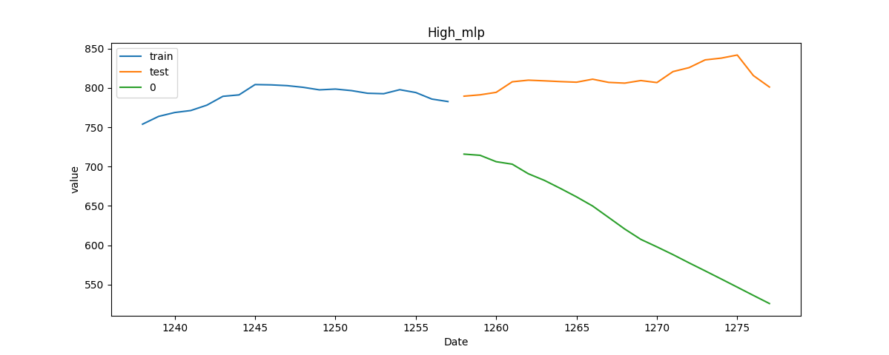
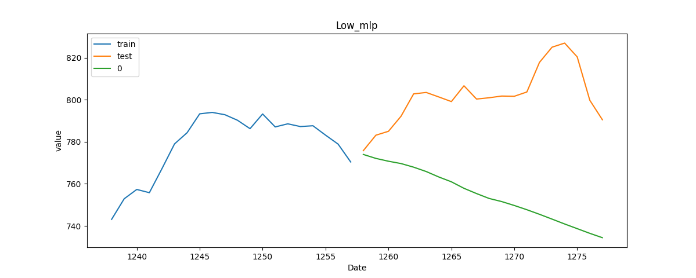
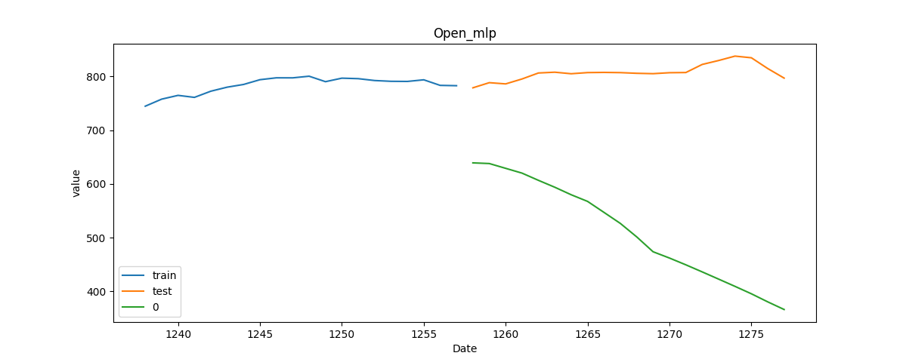

# StockPredictorUsingSktime-dl
Stock Predictor Using Sktime-dl 

## dataset
reference : https://www.kaggle.com/medharawat/google-stock-price
file directory : ./data
* Google_Stock_Price_Test.csv
* Google_Stock_Price_Train.csv

## environment setting
```bash
conda create -n sktime-dl python=3.6
conda activate sktime-dl
pip install -r ./sktime-dl/build_tools/requirements.txt 
pip install tsfresh
conda deactivate
```

## run
```bash
python time_series_forecasting_for_sktime_dl.py
```

## result
### model files
```bash
model/
├── High_mlp.hdf5
├── Low_mlp.hdf5
.......
└── Open_cnn.hdf5
```

### graph
```bash
graph/
├── High_mlp.png
├── Low_mlp.png
.......
└── Open_cnn.png 
```

## example images



