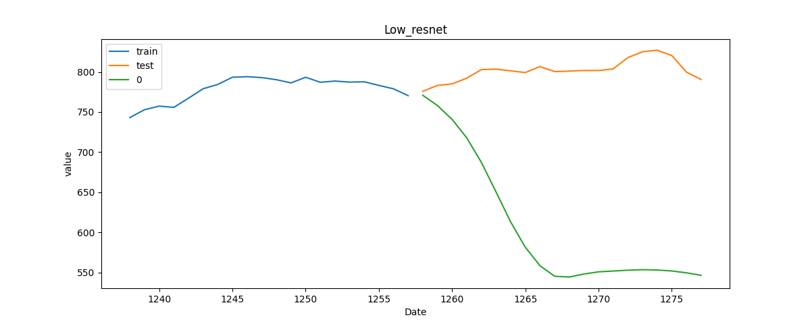
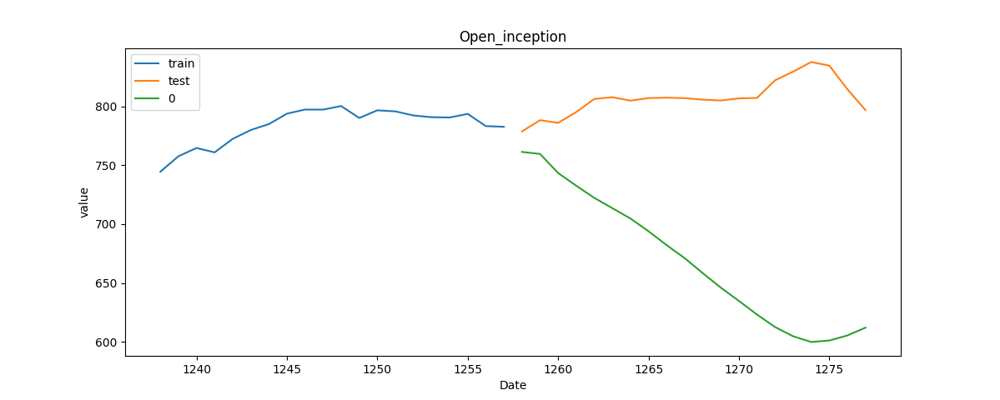

# StockPredictorUsingSktime-dl
Stock Predictor Using Sktime-dl 

## dataset
* reference : https://www.kaggle.com/medharawat/google-stock-price
* file directory : ./data
  * Google_Stock_Price_Test.csv
  * Google_Stock_Price_Train.csv

## environment setting
```bash
conda create -n sktime-dl python=3.6
conda activate sktime-dl
pip install -r ./sktime-dl/build_tools/requirements.txt 
pip install tsfresh matplotlib pathlib
conda deactivate
```
* origin setting : https://github.com/sktime/sktime-dl/blob/master/README.rst
* it doesn't work
* if [this problem](https://github.com/sktime/sktime-dl/issues/76) is solved, you will follow this.

## run
```bash
python time_series_forecasting_for_sktime_dl.py \
    -t './data/Google_Stock_Price_Train.csv' \
    -v './data/Google_Stock_Price_Test.csv'
```

## result
### model files
```bash
model/
├── High_mlp.hdf5
├── Low_mlp.hdf5
.......
└── Open_cnn.hdf5
```

### graph
```bash
graph/
├── High_mlp.png
├── Low_mlp.png
.......
└── Open_cnn.png 
```

## example images




## Reference
* [sktime](https://github.com/alan-turing-institute/sktime)
* [sktime-dl](https://github.com/sktime/sktime-dl)
* [sktime-dl example](https://github.com/sktime/sktime-dl/blob/master/examples/univariate_time_series_regression_and_forecasting.ipynb)
